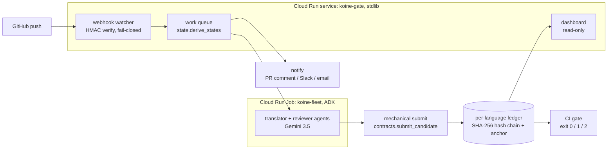

# koine

**Multilingual repos that cannot silently lie.** koine keeps a repository's
documentation synchronized across languages — not by translating harder, but
by making it *mechanically impossible* for a stale or edited translation to
claim it is current. An agent fleet proposes translations, reviews them
adversarially, and curates terminology; **no model ever decides what counts
as up to date.** State is derived from hashes alone.

> The unlikely hero: the non-English-speaking developer. Most of the world's
> programmers read documentation in a language they didn't grow up in — and
> most translated docs are quietly out of date, which is worse than absent:
> a README that lies tells you the old pytest command with total confidence.

## The one invariant

A translation's state (`CURRENT`, `STALE`, `TAMPERED`, `UNSOURCED`,
`MACHINE_ONLY`, `UNTRANSLATED`, …) is a pure function of content hashes and a
tamper-evident ledger — including *where* each translated block lives, which is read from
the ledger and never inferred from the source's own block numbering (a
translation with a banner the source lacks is not index-aligned with it).
The fleet's language models:

- receive prose with protected spans (code, URLs, env vars, flags, paths)
  **frozen into placeholders** they cannot alter — restoration is verified
  byte-for-byte, mechanically;
- can **reject** a candidate translation with findings, but cannot approve
  one — there is no `approve()` tool, because a model's approval would put
  a model back into the trust path;
- can **propose** glossary entries, but only a human binds them.

Every promoted translation is recorded in an append-only, hash-chained
ledger that lives in the repo and travels with git. A stdlib-only external
verifier (`scripts/verify_ledger.py`) re-derives the chain without importing
any koine code.

## What the gate catches

| Situation | State | CI |
|---|---|---|
| Source paragraph edited after translation | `STALE` | exit 1 |
| Doc never translated to a language | `UNTRANSLATED` | exit 1 |
| Recorded translation block edited by hand | `TAMPERED` | exit 2 |
| Content added to a translation the source never had | `UNSOURCED` | exit 2 |
| Ledger rewritten or reordered | broken chain | exit 2 |
| Ledger tail truncated or rebuilt | anchor mismatch | exit 2 |
| Binding glossary term rendered differently | violation | exit 1 |
| Unreviewed machine translation | `MACHINE_ONLY` | visible, allowed by default |
| Adopted legacy pair, meaning never verified | `LEGACY_UNVERIFIED` | visible, allowed by default |
| Orphan block present when the pair was adopted | `LEGACY_ORPHAN` | visible, allowed by default |

`MACHINE_ONLY` is koine's honest answer to languages the maintainer cannot
review: the translation ships, labeled as machine-maintained, never
laundered into `CURRENT`. An honest "unverified" beats a confident lie.

The last four rows are the ones a summary is tempted to round off, so the
gate refuses to: when it passes with any of them present it prints
*"passing — nothing stale or tampered, but not all current: …"*, never
"all translations current".

### Two things hashes alone cannot see

**Content the source never had.** Appending a paragraph to a translated file
edits no *recorded* block, so every hash still matches. The check that sees it
runs on the translation side: any block no source block maps to is `UNSOURCED`.
Orphans that already existed when the pair was adopted are recorded by content
hash and allowed as `LEGACY_ORPHAN` — identity is the hash, so an orphan that is
later edited is no longer the one that was adopted. With no records for a pair
at all, koine says nothing about it rather than making a claim it cannot back.

**A truncated tail.** Entries 0..7 of a valid 0..9 chain are themselves a valid
chain, so linkage and integrity pass. Each chain therefore keeps an `anchor`
sidecar naming its expected head and length. Its limit, stated plainly: it makes
truncation a two-file edit visible in review and in git history, and it catches
accidental loss — a bad merge, a partial write, one file reverted. It does not
stop someone who rewrites both files; only a copy koine does not control, such
as the remote git history, does that. A chain with no anchor is reported as
`VERIFIED (unanchored: truncation undetectable)`, never a bare `VERIFIED`.

## The fleet (Google ADK)

| Agent | May do | May never do |
|---|---|---|
| watcher | read block states, order the work queue | mark anything current |
| translator | translate a frozen template | see or touch protected spans |
| reviewer | REJECT with findings | approve |
| steward | PROPOSE glossary entries | bind them |

Tool contracts are strictly disjoint (`koine/agents/contracts.py`); the only
writers to the ledger are pipeline functions that run mechanical checks first.

## Adopting a repo that already has translations

Nobody starts from zero. `koine adopt` aligns existing translations against
the source by structure, seeds the per-language ledgers, and — crucially —
records every adopted pair as `LEGACY_UNVERIFIED`, never `CURRENT`: alignment
is a hypothesis, and koine refuses to mint trust it cannot back. Orphan
translation blocks (content with no source counterpart, usually sections
deleted from the source but never from the translation) are reported *and
recorded by content hash*, so the gate can later tell them apart from content
appended to the translation after adoption.

```bash
python3 -m koine adopt --source README.md \
  --translation es=README.es.md --translation ru=README.ru.md
python3 -m koine status --source README.md --translation es=README.es.md
```

State lives in `.koine/`: one hash chain per language (so concurrent
per-language PRs never conflict) under a versioned root manifest.

## Quick start

```bash
pip install -e ".[dev]"       # deterministic core: zero dependencies
python3 -m pytest             # tests incl. tamper + determinism + fleet orchestration
python3 -m koine gate --source README.md \
  --translation es=README.es.md --translation ru=README.ru.md
python3 -m koine verify                                # every chain
python3 scripts/verify_ledger.py .koine/ledger.es.jsonl   # external, stdlib-only
python3 scripts/torture.py path/to/any/repo           # freeze/thaw roundtrip

pip install -e ".[agents]"    # the ADK fleet (needs a Gemini credential)
python3 -m koine translate --source README.md --translation es=README.es.md
```

Without ADK or a credential the deterministic pipeline works in full; only
translation *generation* needs a model. The gate never does.

`koine translate --dry-run` needs neither, and is the thing worth running
before you trust a translation pass: it prints the **frozen template** of every
pending block — the exact bytes a model would receive, protected spans already
replaced by `⟦K0⟧`-style placeholders. If a URL or a flag is visible there, the
freeze missed it, and you know before a model ever sees the text.

Code fences and frontmatter are copied into the translated file **verbatim**,
mechanically, with no model involved — a translated README without its code
blocks is not a translated README.

Deleting a section from the source removes its translation too, so a translated
file stops documenting what the source no longer has. Removal is fenced in:
koine deletes a block only if the content hash is one it recorded writing
itself, and records a `retire` event carrying that hash. A hand-added paragraph
or an adopted orphan is never touched — it stays visible as `UNSOURCED` or
`LEGACY_ORPHAN` for a human to resolve.

## Known limitation: block identity is positional

A source block is identified by its index. Insert a paragraph near the top of a
document and every block below it shifts, so all of them are reported `STALE`
and re-translated, though not one word of them changed. Nothing is corrupted
and nothing is falsely `CURRENT` — the failure is cost, plus a `STALE` detail
line that says "source changed" when only the position did.

Matching blocks by content hash instead was implemented and measured. It cut a
one-paragraph insertion from a full-document re-translation to a single model
call, and then failed the convergence property on **95 of 120 mutation seeds**:
stale placements resurfaced, blocks were left permanently pending, and the
pipeline stopped reaching a fixed point. It was reverted. Stable block identity
across arbitrary edits is a harder problem than a hash lookup, and convergence
is worth more than the saved calls, so the positional scheme stands until the
identity problem is solved properly.

`tests/test_convergence.py` is what settled that: it edits a document the way
people do — insert, delete, edit, move — and after every edit asserts the
pipeline converged, the gate agrees, the translation says what the source says
block for block, and a second cycle changes nothing.

## Glossary

Agents propose; humans bind. The binding is the enforceable act, so the CLI
records who performed it and refuses to do it anonymously:

```bash
python3 -m koine glossary propose --term "ledger" --rendering es=libro --by agent:steward
python3 -m koine glossary bind    --term "ledger" --by anna     # now gate-enforced
python3 -m koine glossary list
```

Use `@same` as a rendering to require a term be kept verbatim in a language.

## GitHub Action

```yaml
- uses: anna/koine/action@v1
  with:
    source: README.md
    translations: "es=README.es.md ru=README.ru.md"
```

The gate fails red the moment any language silently drifts.

## Status

Built during the All Things Agentic Hackathon submission period. Deterministic
core complete and tested. ADK fleet wiring is done end-to-end
(`koine/agents/orchestrator.py`: watcher-selected blocks → translator →
reviewer → mechanical submit, with model calls injectable so the cycle is
tested without any credential), and driveable from the CLI via `koine
translate`. The GitHub webhook watcher (`koine/webhook.py`) is done too:
stdlib-only HTTP service, HMAC-SHA256 signature verification (fail-closed),
and a work queue mechanically derived from `state.derive_states` — no model,
no dependency on the ADK extra. Cloud Run deployment of that service is still
in progress. Pre-existing work: none — see ATTRIBUTIONS.md.

Six defects that produced a **green gate over a broken translation** are
fixed and pinned by regression tests in `tests/test_placement.py`. Two of them
contradicted guarantees this README already made:

| Defect | What it did | Now |
|---|---|---|
| Placement assumed source-index alignment | overwrote an adopted translation's code fence with prose, duplicated the stale paragraph, reported `CURRENT` | placement is read from the ledger; a collision or a missing recorded block is a mechanical rejection |
| `freeze` applied its patterns in sequence | a later pattern swallowed an earlier placeholder (`<a href="https://x">`), so the block could never be thawed and stayed `UNTRANSLATED` forever — **2.1% of 24k real-world markdown blocks** | one non-overlapping left-to-right scan; 0 failures on the same corpus |
| Ledger appends were unlocked | concurrent writers read the same tail and forked the chain | the read-tail-and-write is held under an exclusive lock |
| Nothing looked at the translation side | appending a paragraph the source never contained edited no recorded block, so the gate printed `all translations current`, exit 0 | unmapped translation blocks are `UNSOURCED`, exit 2; orphans known at adoption stay allowed as `LEGACY_ORPHAN` |
| Truncation was claimed but not checked | deleting the last N ledger entries left a chain that passes linkage *and* integrity — the README promised exit 2 and delivered exit 0 | each chain keeps an anchor of its expected head and length; unanchored chains say so instead of reporting a bare `VERIFIED` |
| The pipeline could only add and overwrite | a section deleted from the source kept being documented in every translation, forever, and no koine command could clear it | its translation is retired and the placement it held is vacated, both recorded; koine removes only content it can prove it wrote |

### Webhook watcher

```bash
export KOINE_WEBHOOK_SECRET=...   # must match the GitHub webhook secret
python3 -m koine.webhook --source README.md \
  --translation es=README.es.md --translation ru=README.ru.md \
  --repo-root /path/to/checked-out/repo --port 8080
```

`GET /livez` (or `/healthz` off Cloud Run) for liveness. `POST /webhook` accepts a GitHub `push` event,
verifies its signature, and returns the mechanically-derived work queue
(which docs/languages/blocks are `STALE` or `UNTRANSLATED`) for any changed
doc — it never runs a model or writes to the ledger itself.

### Dashboard

A read-only web view of the same sealed state, served by koine itself:

```bash
python3 -m koine.dashboard --demo          # sample store, in a temp dir
python3 -m koine.dashboard --source README.md \
  --translation es=README.es.md --translation ru=README.ru.md
```

`GET /` is the status matrix (per block, per language), the chain-of-custody
verification, and the mechanical work queue; `GET /api/snapshot` is the same
data as JSON. It reads the ledgers and never writes, so rendering never mutates
the store. For Cloud Run, `koine.service` serves the dashboard and the webhook
on one port.

### Notifications

When a push introduces drift, koine can tell a human where — as a comment on
the open PR (or the pushed commit), a Slack message, and an email. It is a
narrator: it reports the queue the engine already computed and never forms a
verdict. Each channel is independent and degrades honestly — a channel with no
configuration is skipped, one that fails is reported and takes down neither the
others nor the webhook response — and secrets come only from the environment,
never a flag or a log. It fires only when there is drift, so a clean push is
silent. Configure whichever channels you want:

```bash
# GitHub PR/commit comment
export KOINE_GITHUB_TOKEN=...            # a token with repo comment scope
# Slack
export KOINE_SLACK_WEBHOOK_URL=...       # an incoming-webhook URL
# email
export KOINE_SMTP_HOST=smtp.example.com KOINE_SMTP_PORT=587
export KOINE_SMTP_USER=... KOINE_SMTP_PASSWORD=...
export KOINE_MAIL_FROM=koine@example.com KOINE_MAIL_TO=team@example.com
# KOINE_SMTP_SSL=true for port 465; KOINE_SMTP_STARTTLS defaults to true
```

## Architecture



A rendered, browsable version of this diagram is in
[`docs/architecture.html`](docs/architecture.html).

The model lives inside the fleet, which only *proposes*: every candidate is
re-checked mechanically before `submit_candidate` seals it into the ledger, so
Gemini can never declare a block current. The dashboard and the CI gate read
the same sealed chain; swapping the model backend changes wording, never a
verdict.

## Deploy to Google Cloud Run

The always-on surface (dashboard + webhook) is stdlib-only, so it deploys as
one small service with no model credential:

```bash
gcloud run deploy koine-gate \
  --source . --region us-central1 --allow-unauthenticated
```

`--source .` builds the `Dockerfile`; the default serves the demo store, so the
hosted URL works immediately (`/` dashboard, `/livez` liveness — the Google
Front End reserves `/healthz`, so koine also serves `/livez`). To watch a
real repo, set the secret and override the container args:

```bash
gcloud run deploy koine-gate --source . --region us-central1 \
  --allow-unauthenticated \
  --set-env-vars KOINE_WEBHOOK_SECRET=$SECRET \
  --command python \
  --args=-m,koine.service,--source,README.md,--translation,es=README.es.md
```

Then point the GitHub webhook (content-type `application/json`, the same
secret) at `https://<service-url>/webhook`.

The translation fleet needs a Gemini credential, so it ships as a separate
Cloud Run **Job** built from `Dockerfile.fleet` — it runs one cycle and exits:

```bash
docker build -f Dockerfile.fleet -t gcr.io/$PROJECT/koine-fleet .
docker push gcr.io/$PROJECT/koine-fleet
gcloud run jobs deploy koine-fleet --image gcr.io/$PROJECT/koine-fleet \
  --region us-central1 --set-env-vars GOOGLE_API_KEY=$GEMINI_KEY \
  --args translate,--source,README.md,--translation,es=README.es.md
gcloud run jobs execute koine-fleet --region us-central1
```

For a CI-driven deploy, `cloudbuild.yaml` builds the gate image, pushes it to
Artifact Registry, and deploys the Cloud Run service in one step (see its
header for the one-time repo setup and how to wire a push-to-main trigger):

```bash
gcloud builds submit --config cloudbuild.yaml \
  --substitutions=_REGION=us-central1,_SERVICE=koine-gate,_REPO=koine
```

## License

Apache-2.0.
